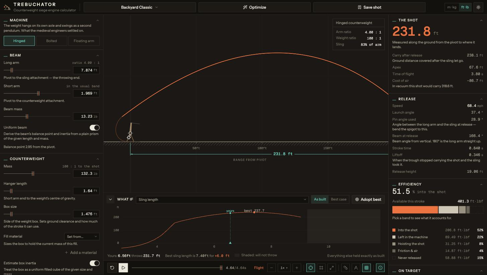
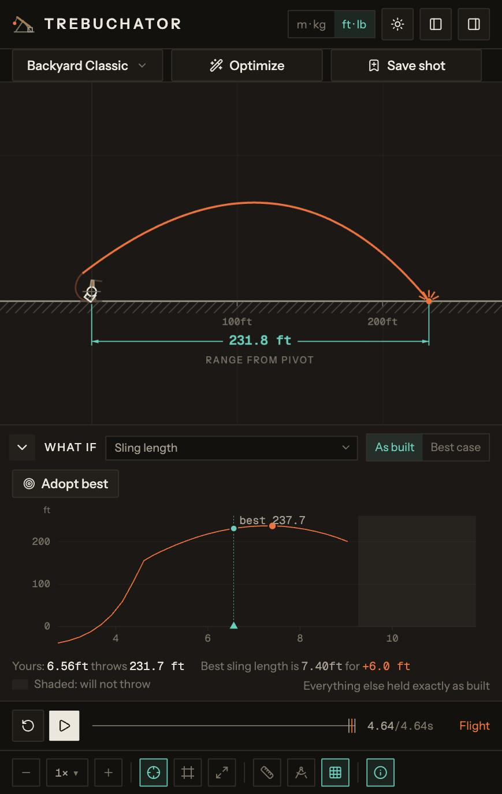

# Trebuchator

A full-screen counterweight trebuchet calculator. Model every dimension, mass and
material property of a machine — medieval or modern — fire it, and watch where the
shot lands.

[](https://github.com/jonjaques/trebuchator/actions/workflows/healthcheck.yml)
[](./LICENSE)
[](https://github.com/jonjaques/trebuchator/graphs/contributors)
[](https://trebuchator.jonjaques.com)

**Live Site: [trebuchator.jonjaques.com](https://trebuchator.jonjaques.com)**

<!-- Widths chosen so both images land on a common height of ~316 px: desktop is
     1456×823 and mobile is 869×1371, so a shared height is the only way a
     landscape and a portrait shot read as one row. GitHub's stylesheet caps
     images at max-width:100%, so on a narrow screen these wrap and shrink
     rather than overflowing. -->
<p>
  
  
</p>

```bash
bun install
bun run dev
```

## What it actually models

Three counterweight topologies, all solved by the same Lagrangian assembler:

| | Weight | Degrees of freedom |
|---|---|---|
| **Hinged** | Hangs on its own axle and swings as a second pendulum | beam, hanger, sling |
| **Bolted** | Rigid on the short arm, dragged through an arc | beam, sling |
| **Floating arm** | Falls straight down a channel while the axle rolls on rails | beam, sling |

A shot runs in three stages. The projectile is first **dragged along the trough**
under a holonomic constraint, and the Lagrange multiplier on that constraint *is*
the trough normal force — liftoff is the instant it passes through zero, which
falls out of the solve rather than being a tuned threshold. It then **swings free**
on the sling until the loop slips the release pin. Finally it **flies** under
quadratic drag with wind and a target elevation offset.

Also modelled: Coulomb friction at the main axle and the counterweight hinge
(scaled by the real bearing reactions), aerodynamic drag on the shot *during* the
stroke, sling and pouch mass as parasitic load, non-uniform beams, and a complete
energy audit that has to close.

Beyond range it reports peak sling tension, peak frame reaction, and beam bending
moment at the pivot — the numbers you need to size an axle rather than guess one.

## Validation

The solver is checked against a published, instrumented machine: Bernaola,
Fernández and Gómez, *The swinging counterweight trebuchet* ([arXiv:2502.19442]),
who recorded beam, counterweight and sling angles through real shots with rotation
sensors.

| | Published | Trebuchator |
|---|---|---|
| Available potential energy | 204 J | 203.8 J |
| Release time, 717 g shot | 0.593 s | 0.575 s |
| Release time, 68.5 g shot | 0.533 s | 0.514 s |
| Range, 717 g, no losses | 42.8 m¹ | 42.8 m |

¹ The paper measures 36.6 m and reports 68.8 % experimental efficiency against
80.4 % for the same machine with no mechanical losses. Scaling its measured range
by that ratio gives the frictionless figure this solver should produce.

Independently, the solver reproduces the design rules of thumb without being told
them: efficiency against counterweight mass peaks at a **100 : 1 weight ratio**,
and the optimal launch angle is exactly 45° in vacuum and lower with drag. Both
are asserted in the test suite.

## Using it

- **Presets** cover a weekend build, a competition floating arm, a pumpkin hurler,
  a 13th-century siege engine, and Edward I's Warwolf. Picking one puts it in the
  address bar, so the link you copy loads what you were looking at — and the
  parameter is *dropped* the moment you edit the machine, because thirty numbers
  are not in the URL and a link that quietly loads something else is worse than
  no link.
- **Find best pin** reports the spigot angle to bend, by running the swing once
  with an ideal-release solver and reading back the angle it chose.
- **Optimize** searches sling length, hanger, cocked angle and short arm and
  returns the Pareto frontier of your chosen goal against peak axle load — feasible
  builds only, none better than another on both counts. Pick the trade you would
  actually build; the pin comes bent to the angle each build wants.
- **What if** sweeps any one parameter and plots range against it, with the
  range your machine gets now and the gain on offer spelled out. *As built*
  changes one number and nothing else; *best case* re-cocks and re-releases at
  every point, which is the honest way to ask what a dimension could give you.
  Hovering the chart draws that machine's trajectory on the sheet; click to
  adopt a value, or hit **Adopt best**.
- **Angles** (`A`) puts protractors on the joints. The one at the beam tip shows
  the sling closing on your pin angle, which is the whole of tuning in one arc.
- **Save shot** keeps a trajectory on the sheet as a dashed ghost to compare against.
- **Your own machines and materials.** Name a build to keep it, and add the fill,
  shot or bearing that is actually in your yard — wet sand is not dry sand. The
  shipped tables stay read-only handbook values so that two people quoting a
  density to each other quote the same number. Both live in this browser's
  storage; there is no backend, and the copy says so rather than implying a sync
  that does not exist.
- **Explanations have three tiers**: a tooltip names an icon, the notes layer
  (`N`) prints what every control measures under its row, and the `?` beside a
  section head opens the paragraph on why a rule of thumb exists. Nothing a
  reader on a phone *needs* is behind a tooltip — those cannot be tapped.
- Keys: `space` play/pause, `R` fire again, `D` dimensions, `A` angles, `G` grid,
  `N` explanations. Drag and scroll the sheet to pan and zoom; the camera also
  follows the shot, frames the machine or frames the whole field on request.
- Units follow your locale on first run (`Intl`, falling back to feet and
  pounds) and remember whatever you pick after that. So does the theme.

## Development

Package manager is **bun** — `bun.lock` is the lockfile, please don't introduce
npm, yarn or pnpm.

```bash
bun install
bun run dev        # Vite dev server on :5173, with HMR
```

| Command | |
|---|---|
| `bun run dev` | Dev server with hot module replacement |
| `bun run build` | `tsc -b` on both projects, then a production bundle into `dist/` |
| `bun run preview` | Serve the production build locally |
| `bun run test` | Vitest, once |
| `bun run test:watch` | Vitest, watching |
| `bun run typecheck` | `tsc -b` alone, no bundle |
| `bun run lint` | ESLint |
| `bun run format` | Rewrite with Prettier |
| `bun run format:check` | Check formatting without writing |
| `bun run healthcheck` | **All of the above that CI runs**, in one pass |
| `bun run deploy` | Build and push to Cloudflare Pages by hand |

`bun run healthcheck` is what the GitHub Action runs, from the same script — so a
green run locally is a green pull request. It deliberately does not stop at the
first failure, so one pass tells you everything that is wrong.

A few compiler flags turn ordinary-looking code into build failures rather than
lint warnings: unused locals and parameters, `verbatimModuleSyntax` (type-only
imports must say `import type`), `erasableSyntaxOnly` (no `enum`, no constructor
parameter properties) and `allowImportingTsExtensions` (local imports carry the
extension, `./App.tsx`).

### Layout

```
src/lib/treb/      the solver — self-contained, SI throughout, no React in it
src/lib/           app-level modules: units, sharing, storage, measurement
src/components/    the panels
src/components/stage/   the drawing: draft.ts → sheet.ts → paint.ts
src/components/ui/      vendored from shadcn — treat as generated
docs/analytics.md  what usage data is collected, and what is not
```

React 19 and TypeScript on Vite, Tailwind v4, drawn to a plain 2D canvas. The solver
runs in a **Web Worker**, because a full shot is 20–45 ms and a 40-point parameter
sweep is over half a second, which is far too long to sit between a slider's
mousemove events. Nothing above `simulator.ts` knows the worker exists.

[`CLAUDE.md`](./CLAUDE.md) is the architecture document: what each module owns, which
decisions are load-bearing, and which apparently-reasonable changes are silently
wrong. It is worth reading before changing anything under `src/lib/treb/`.

### Deployment

`main` is deployed to Cloudflare Pages on push. `bun run deploy` does the same
thing by hand with Wrangler if you need it.

## Privacy

Trebuchator has **no backend and no accounts**. Your machines, materials and
preferences are in your own browser's `localStorage` and go nowhere else.

Anonymous usage events go to Google Analytics so that changes to the product can
be argued from what people do rather than from what we imagine they do — which
parameters get worked, which explanations get opened, how far machines throw.
**Nothing you type is ever sent**: not machine names, not material names, not free
text of any kind. What travels is their shape — how long a name was, which kind of
material it was. [`docs/analytics.md`](./docs/analytics.md) is the full catalogue,
including everything deliberately excluded. Development sends nothing at all.

## Contributing

Bug reports, physics corrections and new machine topologies are all welcome. See
[CONTRIBUTING.md](./CONTRIBUTING.md) — the short version is that `bun run healthcheck`
runs everything CI runs, so a green run locally is a green pull request.

## License

[MIT](./LICENSE) © Jon Jaques

Sources for the historical figures and the design rules are listed in `CLAUDE.md`.

[arXiv:2502.19442]: https://arxiv.org/abs/2502.19442
